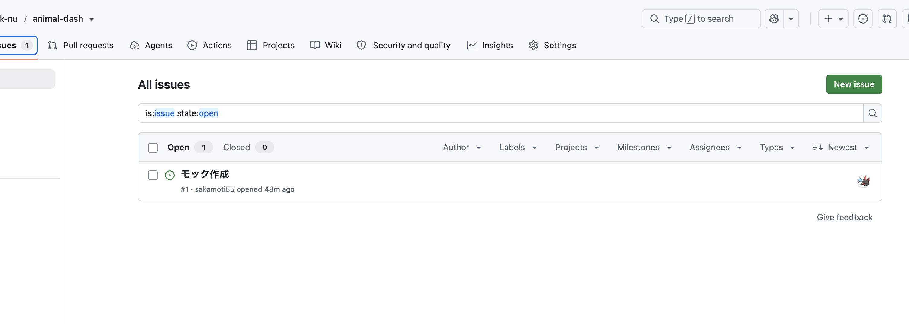
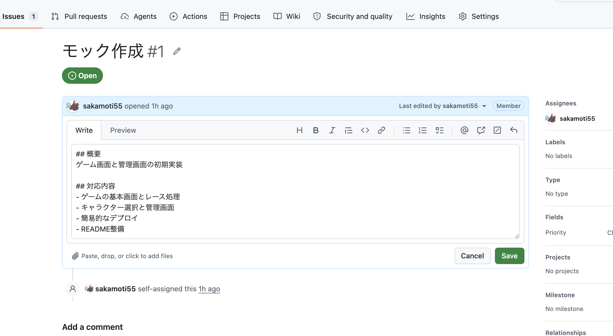
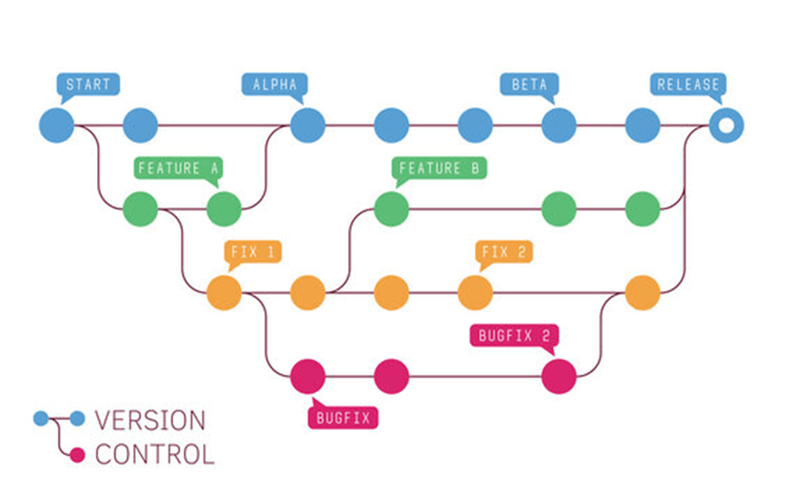
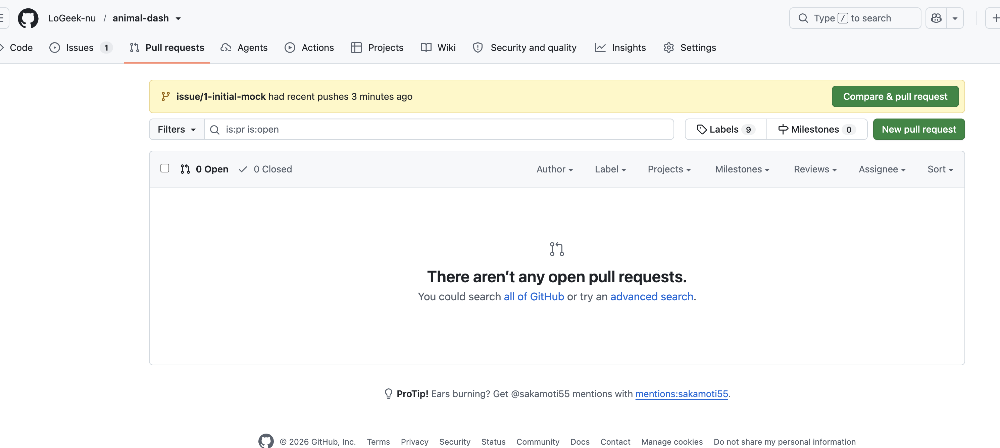
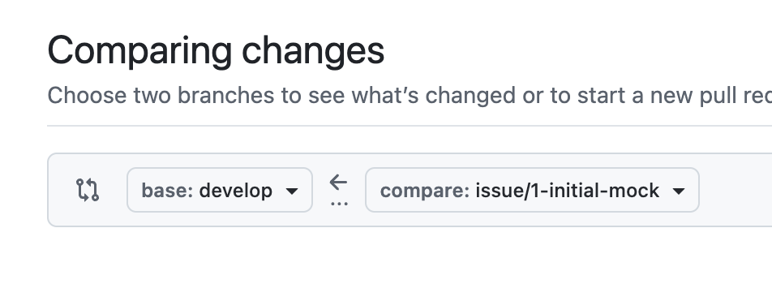
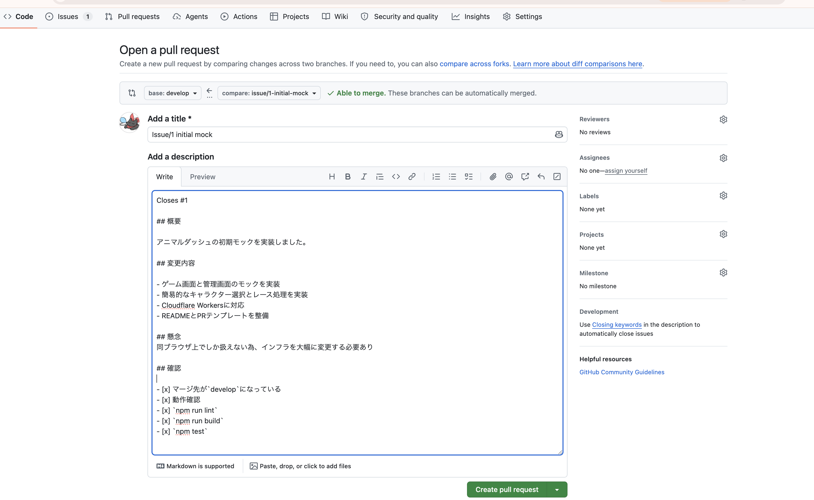
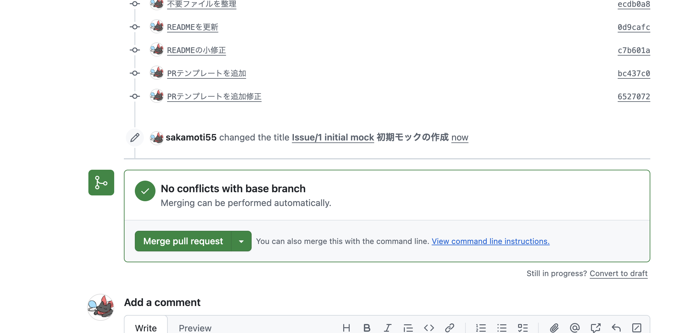

# 開発フロー

基本的には次の流れで開発を進めます。

**Issueを作る → ブランチを作る → 実装・修正する → Pull Requestを作る → developへマージする**

## 1. Issueを作る

### Issueとは？

Issueは、「これから何を実装・修正するのか」をGitHub上で管理するためのものです。たとえば「検索画面を作成する」「画面上部のUIを修正する」といった作業ごとにIssueを1つ作成します。作業の入り口であり、後述のブランチ名やコミットメッセージもこのIssueに紐づけて管理します。

基本的に、Issueを作成してから作業を始めます。GitHubリポジトリの「Issues → New issue」から作成します。



Issue作成時は`.github/ISSUE_TEMPLATE/issue.md`のテンプレートが選択肢に表示されるので、それを選んで概要と完了条件を記入してください。



Issueを作成すると番号が割り当てられます（例: `#1`）。この番号は次の作業ブランチ名に使用します。

## 2. 作業ブランチを作る

### ブランチとは？

ブランチは、同じリポジトリの中で作業内容を分岐させ、他の人の変更に影響を与えずに自分の変更を進めるための仕組みです。`develop`という「本流」から自分専用の作業ブランチを枝分かれさせ、そこで自由にコード変更・コミットを行い、作業が完了したら`develop`へ合流（マージ）させます。ブランチが分かれていれば、複数人が同時に別々の機能を開発してもお互いの作業がぶつかりません。


（出典: [Gitのブランチ機能を完全理解！Git Flow・GitHub Flow・GitLab Flowを実例付きで解説 - Zenn](https://zenn.dev/code_journey_ys/articles/7c7dba4450ff18)）

`develop`から、Issue番号を含む作業ブランチを作成してください。ブランチ名は`issue/<Issue番号>-<作業内容>`とし、作業内容は英語で簡潔に書きます。

```text
issue/4-admin-drag-drop
issue/12-fix-race-layout
```

```bash
git checkout develop
git pull
git checkout -b issue/<Issue番号>-<作業内容>
```

| コマンド | 内容 |
| --- | --- |
| `git checkout develop` | 今いるブランチを`develop`に切り替える |
| `git pull` | リモート（GitHub上）の`develop`の最新の変更を、自分の手元にダウンロードして反映する。これをやらずに作業を始めると、他の人が先に加えた変更が手元に無いまま作業してしまう |
| `git checkout -b issue/<Issue番号>-<作業内容>` | 今いる場所（＝最新化した`develop`）から、新しい作業ブランチを作成し、そのブランチに切り替える |

## 3. 実装・修正する

作業ブランチ上で実装を進め、変更内容は適宜コミットします。

```bash
git add .
git commit -m "管理画面のドラッグ＆ドロップ機能を追加"
```

| コマンド | 内容 |
| --- | --- |
| `git add .` | 変更したファイルすべてを、次のコミットに含める対象として登録する（ステージングと呼びます） |
| `git commit -m "..."` | 登録した変更を、メッセージ付きで1つの記録（コミット）として手元のブランチに保存する。まだGitHub上には反映されていない |

作業が完了したらGitHubへPushします。

```bash
git push -u origin issue/<Issue番号>-<作業内容>
```

`git push`は、手元に溜めたコミットをGitHub（リモート）へ送信するコマンドです。`-u origin issue/<Issue番号>-<作業内容>`は「このブランチをGitHub上の同名ブランチに送り、以後は追跡対象として紐づける」という意味で、初回のpushにのみ必要です（2回目以降は`git push`だけで送れます）。



「Compare & request」が表示されている場合はそれを押してPR作成画面へ移動します。表示されていない場合は「New pull request」から、マージ先（base）を`develop`、マージするブランチをcompareに設定してPRを作成します。



## 4. Pull Request

### Pull Requestとは？

Pull Request（PR）は、「このブランチで行った変更をdevelopへ反映してよいか確認する場所」です。変更内容を他のメンバーが見て、コメントやレビューができます。

作業ブランチから`develop`へPull Requestを作成します。



- PR作成時は`.github/pull_request_template.md`のテンプレートが適用されるので、対応するIssue番号（`Closes #`）、変更内容、確認項目を記入する
- 他のメンバーにレビューを依頼する
- マージ前に[開発ガイドライン](./development-guide.md)記載のコマンド（`npm run lint` / `npm test`）を実行し、テストが失敗している状態ではマージしない

問題がなければ`develop`へMergeします。IssueはMerge時に自動的にCloseされます。



## ブランチ運用

| ブランチ | 用途 |
| --- | --- |
| `main` | 本番用 |
| `develop` | 開発/テスト用 |
| `issue/<番号>-<作業内容>` | Issue単位の作業ブランチ。`develop`から作成し、完了後に`develop`へマージする |

原則として`main`と`develop`へ直接コミットせず、Issueに対応する作業ブランチを使用します。

本番へ反映するときの手順は[本番リリースフロー](./release-flow.md)を参照してください。

## Git / GitHubが初めての場合

このプロジェクトでの開発フローの前提となる、Git / GitHub自体の基本操作（コミット、ブランチ、Pull Requestなど）を学べる資料です。

- [初心者でもわかるGit & GitHub入門 - Qiita](https://qiita.com/Udy03/items/973bb483b9f047877e88) — コマンドの意味から丁寧に説明されています。
- [サル先生のGit入門〜バージョン管理を使いこなそう〜](https://backlog.com/ja/git-tutorial/) — キャラクター解説付きで、Gitの概念（コミット・ブランチ・マージなど）を基礎から学べます。
- [Hello World - GitHub Docs](https://docs.github.com/get-started/quickstart/hello-world) — GitHub公式のチュートリアル。リポジトリ作成からPull Requestまでを実際に手を動かして体験できます（英語）。
- [Gitのブランチ機能を完全理解！Git Flow・GitHub Flow・GitLab Flowを実例付きで解説](https://zenn.dev/code_journey_ys/articles/7c7dba4450ff18) — ブランチという概念自体の解説と、代表的なブランチ運用モデルの比較がまとまっています。

---

[目次に戻る](../README.md#ドキュメント目次)
